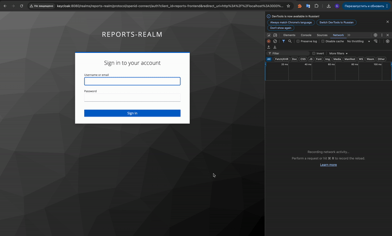

# Инструкция

Запуск приложений
```bash
docker-compose up
```

1. Ссылка на [UI](http://localhost:3000)
2. Ссылка на [admin console keycloak](http://localhost:8080)

Переходим на [UI](http://localhost:3000)
1. Проверяем, что для пользователя `user1` с паролем `password123` нет доступа при получении отчета
2. Проверяем, что для пользователя `prothetic1` с паролем `prothetic123` есть доступ при получении отчета

Отчет получаем от backend - api, который написан на технологиях: Kotlin, Spring, Gradle.

# Примечание
Добавила кнопку `logout`, чтобы было удобнее перелогиниться на другого пользователя

Для того чтобы Keycloak отработал локально нормально необходимо в терминале запустить команду: 
```bash
sudo sh -c "echo '127.0.0.1 keycloak' >> /etc/hosts"
```
Эта команда используется для добавления записи в файл /etc/hosts, связывающей IP-адрес 127.0.0.1 (локальный хост) с именем хоста Keycloak


# 
Проверка работоспособности:
